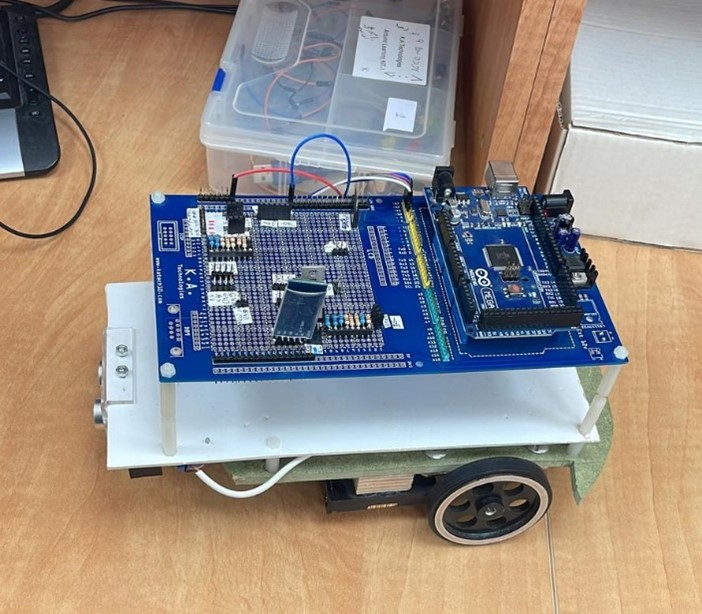
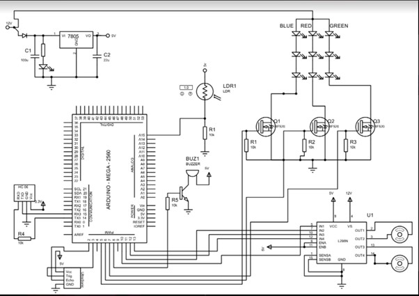

# RobotVision

## Electrical Diagram

The project involves the development of a robot that utilizes artificial intelligence (AI) and machine learning to perform a variety of tasks. The robot can be controlled remotely through a phone connected to a microcontroller using a HC-06 serial communication module. This allows the user to remotely instruct the robot to carry out specific tasks or movements.

One of the key features of the robot is its use of a tensorflow lite model, which enables it to identify objects and accept voice commands through the Google Speech Service. This allows the robot to scan and follow a specific object, or receive movement instructions through voice commands. This is a useful feature for tasks that require the robot to follow or track a specific object or person.

In addition to its AI and machine learning capabilities, the robot is also equipped with a flashing LED light and a distance sensor to help it navigate its surroundings. The LED light can be used to help the robot see in low light conditions or to signal its presence to other people or objects. The distance sensor allows the robot to detect and avoid obstacles as it moves, ensuring that it can safely navigate through its environment.

Overall, the robot is a versatile and intelligent tool that can perform a wide range of tasks, from following objects to navigating through unfamiliar environments. Its use of AI and machine learning, as well as its various sensors and control features, make it a valuable asset for any number of applications.
